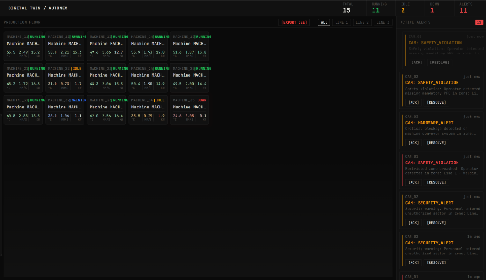
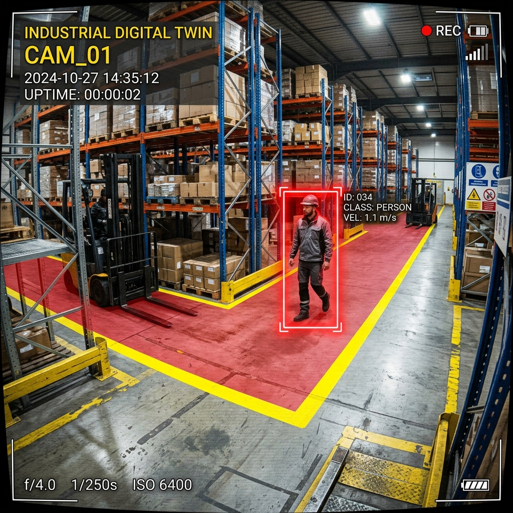

# 🏭 Real-Time Factory Floor Digital Twin Dashboard

[](https://www.typescriptlang.org/)
[](https://react.dev/)
[](https://redis.io/)
[](https://www.postgresql.org/)
[](https://mqtt.org/)
[](https://www.docker.com/)
[](LICENSE)
[](#-testing-results)
[](https://realtime-digital-twin-dashboard.onrender.com)

## 🌐 Live Demo

> **[https://realtime-digital-twin-dashboard.onrender.com](https://realtime-digital-twin-dashboard.onrender.com)**
>
> ⚠️ Hosted on Render's free tier — the backend may take ~30 seconds to wake up on first load. Telemetry data streams live once connected.

A virtual representation (Digital Twin) of a factory floor that processes 1Hz machine telemetry, catches CCTV computer vision safety alerts, and tracks machine downtime on a live WebSockets-powered React workspace.

---

## 📌 Why This Project?
Industrial manufacturing environments often suffer from fragmented data. IoT sensors (PLCs, temperature probes, power meters) publish fast streams, while safety events (PPE violations, restricted zone breaches) occur in separate camera feeds. 

This project solves this by uniting both data streams into a single, unified dashboard. It helps plant supervisors monitor live machine states, check safety warnings with visual previews, and classify downtime events to calculate overall equipment effectiveness (OEE).

---

## 📸 System Interfaces
### 1. Plant Operator SCADA Workspace
The interface uses a monospace layout optimized for dark, high-contrast factory screen environments. `DOWN` machines trigger a blinking pulse highlight to capture attention.


### 2. CCTV Computer Vision Hazard Feed
Safety events (like unauthorized zone entry or missing safety gear) are streamed live to the sidebar panel with preview snapshots to let operators verify alerts visually.


---

## 🏗️ System Architecture

```
[IoT Sensor Simulators] ──(QoS 1 Telemetry)──► [Mosquitto MQTT Broker] ◄──(QoS 2 CV Alerts)── [CCTV Simulators]
                                                     │
                                                     ▼
                                        [MQTT Ingestion Daemon]
                                                     │
                                            (Zod Verification)
                                                     │
                                         [Stream & Alert Processor]
                                          /                      \
                                         /                        \
                   (Immediate Cache updates)              (5s Telemetry Batches)
                                       /                            \
                                      ▼                              ▼
                              [Redis Cache]                [PostgreSQL Database]
                                      │                              │
                      (Heartbeat timeout checks)            (Auditing, Historic Logs)
                                      │                              │
                                      ▼                              ▼
                            [Socket.IO Server] ◄──────────── [Express REST APIs]
                                      │
                              (WS Connection)
                                      │
                                      ▼
                        [Vite + React Operator UI]
```

### 🧠 Simple Project Flow
1. **IoT Simulators** publish temperature, vibration, and power telemetry over MQTT at 1Hz.
2. **CCTV Simulators** publish safety events (e.g. PPE violations, near-misses) over MQTT.
3. The **Ingestion Daemon** validates incoming payloads via Zod schemas and hands them to the Processor.
4. The **Processor** caching layer saves current state in Redis immediately, batches database commits to PostgreSQL every 5 seconds, and evaluates safety limits.
5. Live updates are pushed to the **React UI** via WebSockets, and historical downtime data is fetched via REST API.

---

## 🚀 Quick Start (Docker Setup)

Deploy the entire workspace (MQTT, Redis, Postgres, Backend API, and Frontend UI) with a single command:

1. **Clone the repository:**
   ```bash
   git clone https://github.com/nikhilc1910/realtime-digital-twin-dashboard.git
   cd realtime-digital-twin-dashboard
   ```
2. **Configure Environment Variables:**
   Copy the example environment file:
   ```bash
   cp .env.example .env
   ```
3. **Build and start the containers:**
   ```bash
   docker compose up -d --build
   ```
4. **Run database migrations:**
   Apply database schemas within the backend api container:
   ```bash
   docker compose exec backend npx prisma migrate dev --name init
   ```
5. **Access the services:**
   * **Operator UI Dashboard:** `http://localhost:3000`
   * **Backend API Server:** `http://localhost:5000`
   * **MQTT Broker:** `localhost:1883`

---

## ⚙️ Manual Setup (Local Development)

To run the components individually without Docker:

### 1. Database and Cache setup
Install and run a local PostgreSQL instance and a Redis server. Copy `.env.example` to `.env` in the root workspace and update your connection parameters.

### 2. Start Backend API
```bash
cd backend
npm install
npx prisma migrate dev
npm run dev
```
The server will run on `http://localhost:5000`.

### 3. Start React Client
```bash
cd ../frontend
npm install
npm run dev
```
The UI will launch on `http://localhost:3000`.

### 4. Run Edge Simulators
To stream simulated sensors and camera feeds:
```bash
cd ../simulators
npm install
npm run sensors  # Starts 1Hz machine sensors
npm run camera   # Starts CCTV camera safety event stream
```

---

## 🧠 Key Technical Decisions

### 1. Alert Deduplication (Redis Cache-Aside)
Evaluating thresholds at 1Hz can trigger duplicate alerts. To prevent database read-write storms, active alerts are cached in Redis. When a threshold is breached, the processor checks Redis first; if the alert exists, it updates `updatedAt` in Postgres instead of writing duplicate records.

### 2. Database Write Buffering
Writing telemetry to PostgreSQL at 1Hz per machine creates bottleneck issues. The backend buffers incoming telemetry in-memory and flushes them to PostgreSQL using `createMany` bulk transactions every **5 seconds**, keeping DB overhead low.

### 3. Active Timeout Daemon
If a machine crashes or loses power, it cannot send a shutdown status. A background daemon polls Redis states every 10 seconds. If a machine's last update is older than **60 seconds**, it automatically updates the status to `DOWN`, registers a `SYSTEM_TIMEOUT` downtime event, and fires a critical connectivity alert.

---

## ⚖️ Tradeoffs & Simplifications
*   **Simulators vs. Real PLCs**: We use mock JavaScript simulators instead of hardware PLC modules (Modbus/OPC-UA).
*   **Simple OEE Calculations**: Downtime tracking is calculated from simple duration metrics rather than complex manufacturing schedules.
*   **Postgres for Time Series**: We used standard PostgreSQL instead of a dedicated timeseries database (like InfluxDB). While InfluxDB scales better for high-frequency logs, Postgres simplified database migrations, setup, and relational tables (e.g. users, downtime logs) for local development.

---

## 🛠️ Challenges Faced
*   **Docker WebSocket CORS Errors**: Configuring strict CORS rules on Socket.IO led to browser connection blocks in Docker. We solved this by writing a custom Nginx reverse proxy configuration inside the frontend container to route all `/api` and `/socket.io` websocket traffic straight to the backend container under a single host.
*   **Jest Mock Contamination**: In-memory Redis mocks leaked states between unit test runs. We resolved this by exporting a timer cleanup method (`stopTelemetryBatcher`) and resetting local state variables inside a Jest `beforeEach` hook.

---

## 🧪 Testing Results
The backend includes Jest tests checking alert threshold evaluations, cache lookups, database upserts, and connectivity timeouts:
```bash
cd backend
npm run test
```
All **5 unit and integration tests** compile cleanly and pass successfully with zero memory leaks.

---

## 📖 REST API & WebSockets Documentation

### Health Check Endpoint
*   **`GET /health`** (REST): Verifies service diagnostics. Returns:
    ```json
    {
      "status": "OK",
      "environment": "development",
      "timestamp": "2026-05-26T21:12:40.000Z"
    }
    ```

### REST API Endpoints

| Method | Endpoint | Description |
| :--- | :--- | :--- |
| `GET` | `/api/machines` | Fetch registered machines and their cached stats. |
| `GET` | `/api/machines/:id/telemetry` | Fetch historical metrics for trend charts (`?limit=50`). |
| `GET` | `/api/alerts` | Fetch paginated alerts (`?status=ACTIVE`). |
| `POST`| `/api/alerts/:id/acknowledge` | Acknowledge active alert. |
| `POST`| `/api/alerts/:id/resolve` | Resolve active alert (clears cache). |
| `POST`| `/api/machines/:id/downtime` | Submit OEE downtime classification. |
| `GET` | `/api/machines/:id/downtime` | Fetch downtime logs for a machine. |
| `GET` | `/api/reports/downtime/export` | Download OEE audit logs as a `.csv` file. |

### WebSockets Events (Socket.IO)
*   **Inbound Client Events:**
    *   `join:line` (payload: `{ "lineId": "line_1" }`): Subscribes to a production line.
    *   `leave:line` (payload: `{ "lineId": "line_1" }`): Unsubscribes from a production line.
*   **Outbound Server Events:**
    *   `telemetry:init` (payload: `MachineState[]`): Pre-populates operator screen states.
    *   `telemetry:update` (payload: `MachineState`): Telemetry broadcasted at 1Hz.
    *   `alert:new` (payload: `Alert`): Pushes new safety/threshold alert.
    *   `alert:update` (payload: `Alert`): Pushes alert status changes.

---

## 🔮 Future AI/ML Extensions
*   **LSTM Telemetry Anomaly Detection**: Train a lightweight Long Short-Term Memory (LSTM) network to score incoming vibration and temperature sequences, triggering warning alerts before thresholds are breached.
*   **Predictive Maintenance Models**: Estimate remaining useful life (RUL) of machine bearings by analyzing power and vibration fatigue trends over time.

---

## 🤝 License
This project is licensed under the MIT License - see the [LICENSE](LICENSE) file for details.
